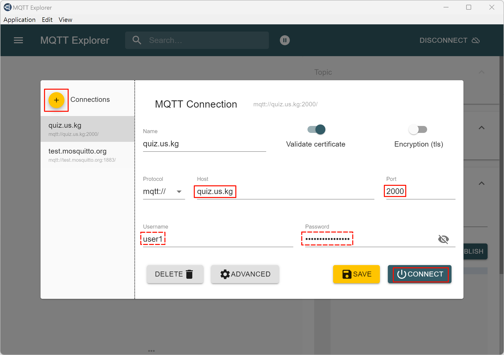

# MQTT 協定

- [Topic 結構](#topic-%E7%B5%90%E6%A7%8B)
- [QoS 等級](#qos-%E7%AD%89%E7%B4%9A)
- [MQTT 伺服器](#mqtt-%E4%BC%BA%E6%9C%8D%E5%99%A8)
	- [安裝](#%E5%AE%89%E8%A3%9D)
	- [創建用戶](#%E5%89%B5%E5%BB%BA%E7%94%A8%E6%88%B6)
	- [設定文件](#%E8%A8%AD%E5%AE%9A%E6%96%87%E4%BB%B6)
	- [啟動服務](#%E5%95%9F%E5%8B%95%E6%9C%8D%E5%8B%99)
	- [測試](#%E6%B8%AC%E8%A9%A6)
- [MQTT 客戶端](#mqtt-%E5%AE%A2%E6%88%B6%E7%AB%AF)
	- [連線到 MQTT 伺服器](#%E9%80%A3%E7%B7%9A%E5%88%B0-mqtt-%E4%BC%BA%E6%9C%8D%E5%99%A8)
	- [發布主題](#%E7%99%BC%E5%B8%83%E4%B8%BB%E9%A1%8C)
	- [訂閱主題](#%E8%A8%82%E9%96%B1%E4%B8%BB%E9%A1%8C)
- [參考資料](#%E5%8F%83%E8%80%83%E8%B3%87%E6%96%99)


MQTT（Message Queuing Telemetry Transport）是一個輕量級的、基於發布/訂閱模式的網絡協定，專為低帶寬、高延遲或不可靠網絡環境設計。MQTT 協定基於 TCP/IP 協定，並且支持 QoS（Quality of Service）等級。

- MQTT Broker: 整個通訊系統的核心，負責接收並分發由 MQTT 客戶端發送的訊息，客戶端（例如感測器、伺服器、閥門等裝置）不會直接彼此通訊，而是通過 Broker 來傳遞訊息。
- Topic: 用來區分不同訊息的標識，不同的客戶端可以訂閱不同的 Topic，當有訊息發布到某個 Topic 時，訂閱了該 Topic 的客戶端就會收到這個訊息。
- MQTT Clients
	- Publisher（發布者）: 通過 Publish（發布）訊息到 Broker，這些訊息包含了 Topic 信息。
	- Subscriber（訂閱者）: 通過 Subscribe（訂閱）某個 Topic 來接收訊息。

## Topic 結構

MQTT 的 Topic 是 UTF-8 字串，可以包含多個層級，層級數量沒有限制，層級之間使用 `/` 分隔。

例如：`home/livingroom/temperature`

## QoS 等級

QoS 是 MQTT 中用於控制訊息傳輸質量的機制，MQTT 支持三種 QoS 等級：
- QoS 0: 最多傳輸一次，且不保證訊息能夠成功傳出
- QoS 1: 至少傳輸一次，可以確保消息能夠到達接收端，但可能會重複傳輸
- QoS 2: 確保傳輸一次，傳送訊息時會分成兩段式，並保證消息能夠到達接收端，但也可能導致較高的延遲

## MQTT 伺服器

**mosquitto**: 是一個開源的 MQTT 伺服器，支持 MQTT 3.1 和 3.1.1 協定，並且提供了一個簡單的命令行工具來測試 MQTT 伺服器。

### 安裝

```bash
sudo apt install -y mosquitto mosquitto-clients
```

### 創建用戶

創建一個用戶名和密碼文件，用於身份驗證。

```bash
sudo mosquitto_passwd -c <password_file> <username>
```

### 設定文件

mosquitto 的設定文件位於 `/etc/mosquitto/mosquitto.conf`

- `listener`: 監聽的端口和 IP
- `allow_anonymous`: 允許匿名訪問（127.0.0.1 時不做身份驗證）
- `password_file`: 用戶名和密碼文件

```conf
listener 1883 0.0.0.0
allow_anonymous false
password_file <password_file>
```

### 啟動服務

```bash
sudo systemctl restart mosquitto
```

### 測試

```bash
# bash 1
# 訂閱主題
mosquitto_sub -h localhost -t test/topic -u <username> -P <password>

# bash 2
# 發布訊息
mosquitto_pub -h localhost -t test/topic -m "Hello, MQTT" -u <username> -P <password>
```

## MQTT 客戶端

下載執行檔 [MQTT-Explorer](https://github.com/thomasnordquist/MQTT-Explorer/releases/download/v0.3.5/MQTT-Explorer-0.3.5.exe)

### 連線到 MQTT 伺服器



### 發布主題


### 訂閱主題

該程式會去訂閱所有主題，只要有變動的都會記錄在此


## 參考資料

- [一次弄懂 MQTT ！物聯網通訊協定全面指南 | Webduino 教學資源](https://resource.webduino.io/blog/mqtt-guide)