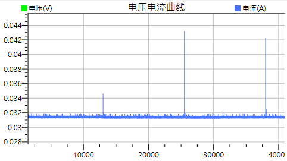

# NB-IoT 工作模式

- [模式切換狀態](#%E6%A8%A1%E5%BC%8F%E5%88%87%E6%8F%9B%E7%8B%80%E6%85%8B)
- [模式運行流程](#%E6%A8%A1%E5%BC%8F%E9%81%8B%E8%A1%8C%E6%B5%81%E7%A8%8B)
	- [TAU 觸發實例](#tau-%E8%A7%B8%E7%99%BC%E5%AF%A6%E4%BE%8B)
- [NB-IoT 的節能方案](#nb-iot-%E7%9A%84%E7%AF%80%E8%83%BD%E6%96%B9%E6%A1%88)
	- [DRX 非連續接收模式](#drx-%E9%9D%9E%E9%80%A3%E7%BA%8C%E6%8E%A5%E6%94%B6%E6%A8%A1%E5%BC%8F)
	- [eDRX 擴展非連續接收模式](#edrx-%E6%93%B4%E5%B1%95%E9%9D%9E%E9%80%A3%E7%BA%8C%E6%8E%A5%E6%94%B6%E6%A8%A1%E5%BC%8F)
	- [PSM 省電模式](#psm-%E7%9C%81%E9%9B%BB%E6%A8%A1%E5%BC%8F)
- [參考資料](#%E5%8F%83%E8%80%83%E8%B3%87%E6%96%99)


NB-IoT 中通過不同的工作模式來實現節能

## 模式切換狀態


- Connent 連接模式: 收發資料所使用的模式
  - 其他模式中收發資料會進入 Connent 連接模式
  - 停止後會進入 IDLE 空閒模式
- IDLE 空閒模式: 又稱**淺睡眠 (light sleep)**，網路保持連接，可接收尋呼消息
  - 發送資料會進入 Connent 連接模式
  - 等到 T3324 超時後會進入 PSM 省電模式
- PSM 省電模式 (Power Saving Mode): 又稱**深睡眠 (deep sleep)**，只有 RTC 保持運作，網路為非連接狀態，不可接收尋呼消息
  - 主動發送資料會進入 Connent 連接模式
  - 等到 T3412 超時會觸發 TAU 更新，進入 Connent 連接模式

> - 尋呼消息 (Paging Message): 供應商網路發送給設備的消息，用於通知設備有資料需要接收
> - RTC (Real Time Clock): 實時時鐘

## 模式運行流程


T3324 和 T3412 是兩個關鍵的計時器：
- **T3324**：活動時間計時器（Active Time Timer），定義設備在進入空閒模式後保持活躍的時間。
- **T3412**：週期性追蹤區更新計時器（Periodic Tracking Area Update Timer），決定設備在進入省電模式後，定期向網路報告其狀態的間隔時間。

步驟:
1. 收發資料在 Connent 連接模式，當停止後進入 IDLE 空閒模式
2. 在 IDLE 模式期間如果沒有收到尋呼消息即無資料需要接收，則等待 T3324 超時後進入 PSM 省電模式
3. 在 PSM 模式無法接收資料，如果沒有主動發送資料，等到 T3412 超時後會觸發 TAU 更新，進入 Connent 連接模式

> TAU (Tracking Area Update): 設備更新 UE 設備的位置資訊，像網路報告當前狀態，以便讓網路知道設備還處於活動狀態

### TAU 觸發實例



圖中的三次高電流消耗為 TAU 更新時的狀態，每次 TAU 更新後會進入 Connent 連接模式

```shell
# ======================================================================
# T3324 為 00100010，即 2 分鐘
# T3412 為 00010110，即 220 分鐘
02:59:24.687 -> +CEREG: 1,"CE40","0C6EDE83",9,0,0,"00100010","00010110"
# 等待 2 分鐘後 T3324 超時，進入 PSM
03:01:24.837 -> +QNBIOTEVENT: "ENTER PSM"
# 等待 218 分鐘後 T3412 超時
# **觸發 TAU 更新**
06:39:26.009 -> +CEREG: 2,"CE40","0C6EDE83",9,0,0,"00100010","00010110"
06:39:26.043 -> +QNBIOTEVENT: "EXIT PSM" # 離開 PSM，進入連接模式
06:39:26.493 -> +CEREG: 1,"CE40","0C6EDE83",9,0,0,"00100010","00010110"
# ======================================================================
# 重新設定的 T3412 被更新為 00010101，即 210 分鐘
06:39:26.664 -> +CEREG: 1,"CE40","0C6EDE83",9,0,0,"00100010","00010101"
# 等待 2 分鐘後 T3324 超時，進入 PSM
06:41:26.802 -> +QNBIOTEVENT: "ENTER PSM"
# 等待 208 分鐘後 T3412 超時
# **觸發 TAU 更新**
10:09:27.949 -> +CEREG: 2,"CE40","0C6EDE83",9,0,0,"00100010","00010101"
10:09:27.949 -> +QNBIOTEVENT: "EXIT PSM" # 離開 PSM，進入連接模式
10:09:28.207 -> +CEREG: 1,"CE40","0C6EDE83",9,0,0,"00100010","00010101"
# ======================================================================
# 計時器皆未更新
# 等待 2 分鐘後 T3324 超時，進入 PSM
10:11:28.839 -> +QNBIOTEVENT: "ENTER PSM"
# 等待 208 分鐘後 T3412 超時
# **觸發 TAU 更新**
13:39:29.997 -> +CEREG: 2,"CE40","0C6EDE83",9,0,0,"00100010","00010101"
13:39:29.997 -> +QNBIOTEVENT: "EXIT PSM" # 離開 PSM，進入連接模式
13:39:30.589 -> +CEREG: 1,"CE40","0C6EDE83",9,0,0,"00100010","00010101"
# ======================================================================
```


## NB-IoT 的節能方案

### DRX 非連續接收模式


**DRX 非連續接收模式 (Discontinuous Reception) 模式**，雖然名稱為非連續接收，但對硬體產品通訊的宏觀層面來說是**連續接收**的，可以隨時接收資料因此**待機功耗相對於其他模式較高約為 1mA**

### eDRX 擴展非連續接收模式


**eDRX 擴展非連續接收 (Extended Discontinuous Reception) 模式**，是在 DRX 模式上的一種擴展，通過在 DRX 周期中**增加一個長時間的空閒時間**，以進一步降低功耗，**待機功耗約為 0.1mA**
  
### PSM 省電模式


**PSM 省電模式 (Power Saving Mode)**，在設備長時間 (T3412 時間) 無接收尋呼時，進入 PSM 模式，完全關閉通訊模組，只保持 RTC 運作，**待機功耗約為 0.1uA**

## 參考資料

- [NB-IoT的低功耗介绍-大连哲勤科技有限公司](http://www.infwin.com.cn/docs/nb-iot%e7%9a%84%e4%bd%8e%e5%8a%9f%e8%80%97%e4%bb%8b%e7%bb%8d)
- [NB-IoT移远BC95使用小结-大连哲勤科技有限公司](http://www.infwin.com.cn/docs/nb-iot%E7%A7%BB%E8%BF%9Cbc95%E4%BD%BF%E7%94%A8%E5%B0%8F%E7%BB%93)
- [NB-IOT低功耗详解 - 谷雨文档中心](http://doc.iotxx.com/NB-IOT%E4%BD%8E%E5%8A%9F%E8%80%97%E8%AF%A6%E8%A7%A3)
- [NB-IoT 及 Cat-M 的省電模式 | DigiKey](https://www.digikey.tw/zh/articles/how-to-enable-power-saving-modes-of-nb-iot-and-cat-m)