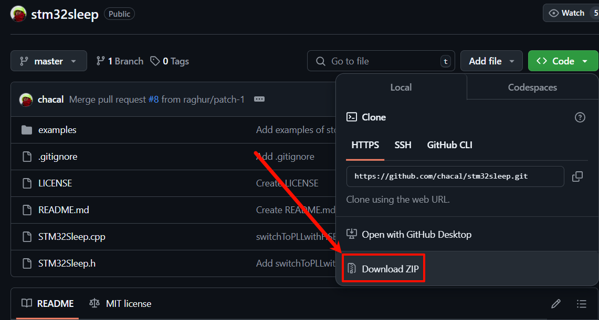
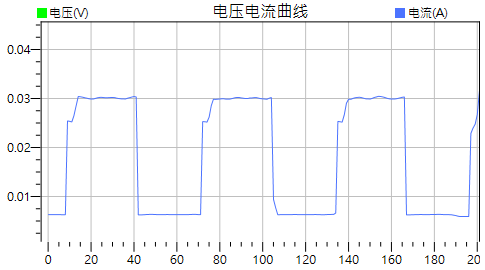

# STM32 功耗控制

使用 Arduino 庫的兩種功耗控制方案：

- [STM32LowPower](https://github.com/stm32duino/STM32LowPower): 官方提供的低功耗庫，使用核心是 **Arduino_Core_STM32**
  - 支持模式
    - Idle mode (待機模式): 微秒級低延遲喚醒，僅核心節電，記憶體和電壓保留，省電效果有限
    - sleep mode (睡眠模式): 微秒級低延遲喚醒，比 Idle Mode 更省電，記憶體和電壓保留
    - deep sleep mode (深度睡眠模式): 毫秒級中等延遲喚醒，時鐘關閉節能，記憶體和電壓保留，部分外設可喚醒
    - shutdown mode (關機模式): 高延遲喚醒（數百毫秒或更長），電壓幾乎全關，記憶體內容丟失，喚醒相當於重啟
  - 環境要求:
    - [Arduino_Core_STM32](https://github.com/stm32duino/Arduino_Core_STM32) version >= 1.3.0
    - [STM32RTC](https://github.com/stm32duino/STM32RTC)

- [STM32Sleep](https://github.com/chacal/stm32sleep): 由社區提供的低功耗庫，使用核心是 **Arduino_STM32**
  - 支持模式
    - Standby mode (待機模式): 官方無特別說明
    - Stop mode (停止模式): 官方無特別說明
  - 環境要求:
    - [Arduino_STM32](https://github.com/rogerclarkmelbourne/Arduino_STM32)

## DSI2598+ STM32 功耗控制

因為 DSI2598+ 使用的是 **Arduino_STM32** 核心，所以只能使用 **STM32Sleep** 這個庫。

### 安裝 STM32Sleep

1. **下載**: [STM32Sleep](https://github.com/chacal/stm32sleep) 庫

    

2. **解壓縮**: `stm32sleep-master.zip`

3. **重新命名**: 重新命名解壓縮後的**資料夾** `stm32sleep-master` -> `STM32Sleep`

4. **移動**: 移動 **`STM32Sleep` 資料夾**到 Arduino 的庫目錄下 `C:\Users\user\Documents\Arduino\libraries`


### 使用 STM32Sleep 進入待機模式

- 從待機模式喚醒後，相當於重啟，會執行 `setup()`

```cpp
/*
模擬運行 30 秒後，進入待機模式 30 秒
*/

#include <STM32Sleep.h>
#include <RTClock.h>

RTClock rt(RTCSEL_LSE);
long int alarmDelay = 30;

void setup()
{
    // 從 Standby 待機模式喚醒會執行 setup()
    delay(30000);
    sleepAndWakeUp(STANDBY, &rt, alarmDelay);  
}

void loop() {}  // 這裡永遠不會執行
```

### 待機模式下的功耗



- 正常模式下的功耗約為 30mA
- 待機模式下的功耗約為 6mA