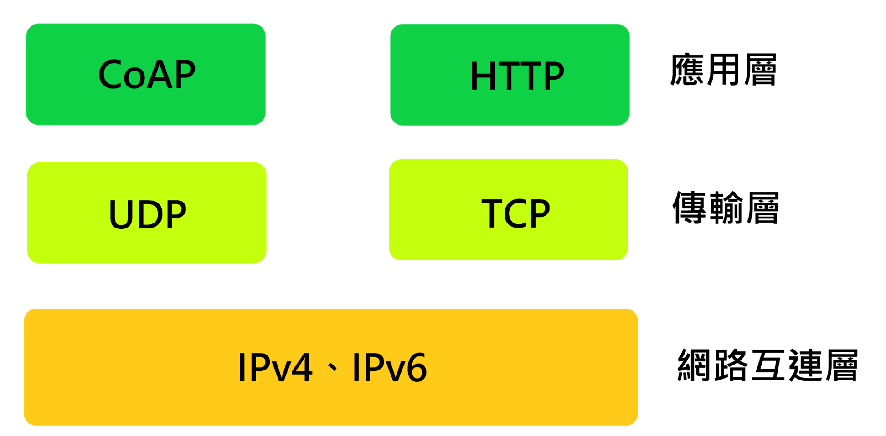

# CoAP 協議介紹

- [協議特點](#%E5%8D%94%E8%AD%B0%E7%89%B9%E9%BB%9E)
- [協定 TCP/IP 模型](#%E5%8D%94%E5%AE%9A-tcpip-%E6%A8%A1%E5%9E%8B)
- [協議封包格式](#%E5%8D%94%E8%AD%B0%E5%B0%81%E5%8C%85%E6%A0%BC%E5%BC%8F)
	- [消息類型 `T`](#%E6%B6%88%E6%81%AF%E9%A1%9E%E5%9E%8B-t)
	- [功能碼 `Code`](#%E5%8A%9F%E8%83%BD%E7%A2%BC-code)
		- [客戶端請求](#%E5%AE%A2%E6%88%B6%E7%AB%AF%E8%AB%8B%E6%B1%82)
		- [客戶端請求錯誤](#%E5%AE%A2%E6%88%B6%E7%AB%AF%E8%AB%8B%E6%B1%82%E9%8C%AF%E8%AA%A4)
		- [伺服器回應](#%E4%BC%BA%E6%9C%8D%E5%99%A8%E5%9B%9E%E6%87%89)
		- [伺服器回應錯誤](#%E4%BC%BA%E6%9C%8D%E5%99%A8%E5%9B%9E%E6%87%89%E9%8C%AF%E8%AA%A4)
		- [訊號碼](#%E8%A8%8A%E8%99%9F%E7%A2%BC)
	- [選項 `Options`](#%E9%81%B8%E9%A0%85-options)
		- [資料格式](#%E8%B3%87%E6%96%99%E6%A0%BC%E5%BC%8F)
		- [選項編號類型](#%E9%81%B8%E9%A0%85%E7%B7%A8%E8%99%9F%E9%A1%9E%E5%9E%8B)
			- [`Content-Format` 選項](#content-format-%E9%81%B8%E9%A0%85)
- [參考資料](#%E5%8F%83%E8%80%83%E8%B3%87%E6%96%99)


CoAP (Constrained Application Protocol) 受限應用協議，它是一個輕量級的協議，適用於低功耗、低帶寬的網絡環境。

## 協議特點

- 基於 UDP 傳輸
    - CoAP 使用 UDP（User Datagram Protocol），減少了協議開銷
    - 不需要建立長連接，傳輸效率高，適合間歇性通信的 IoT 設備
    - 不需要維持長連接，大幅降低設備的能耗
- 輕量設計
    - 數據包頭部僅需 4 字節，極大地減少了網路帶寬的佔用
    - 適用於低功耗、低內存的設備
- 類似 HTTP 的 RESTful 模型
    - 支援標準的 GET、POST、PUT、DELETE 方法，方便開發者理解和使用
    - 簡化版 HTTP，專為 IoT 設備量身打造
- 可靠性選項
    - 雖然基於 UDP，CoAP 提供可選的可靠傳輸機制（如 ACK 確認），在需要時確保數據完整性


| 特性       | CoAP                  | HTTP                   |
| ---------- | --------------------- | ---------------------- |
| 傳輸協定   | UDP                   | TCP                    |
| 開銷       | 小（數據頭部 4 字節） | 大（數據頭部較多）     |
| 連接方式   | 短連接                | 長連接                 |
| 傳輸可靠性 | 可選（ACK 機制）      | 內建可靠性             |
| 功耗       | 低                    | 高                     |
| 適用場景   | IoT、低功耗設備       | Web 瀏覽器與伺服器互動 |

## 協定 TCP/IP 模型



CoAP 協議位於應用層，基於 UDP 協議，不須建立長連接，適合 IoT 設備之間的通信。

## 協議封包格式

```cpp
+-+-+-+-+-+-+-+-+-+-+-+-+-+-+-+-+-+-+-+-+-+-+-+-+-+-+-+-+-+-+-+-+
|    1 bytes    |    2 bytes    |     3 bytes   |     4 bytes   |
|0 1 2 3 4 5 6 7 0 1 2 3 4 5 6 7 0 1 2 3 4 5 6 7 0 1 2 3 4 5 6 7|
+-+-+-+-+-+-+-+-+-+-+-+-+-+-+-+-+-+-+-+-+-+-+-+-+-+-+-+-+-+-+-+-+
|Ver| T |  TKL  |      Code     |          Message ID           |
+-+-+-+-+-+-+-+-+-+-+-+-+-+-+-+-+-+-+-+-+-+-+-+-+-+-+-+-+-+-+-+-+
|                  Token (可選, TKL bytes) ...
+-+-+-+-+-+-+-+-+-+-+-+-+-+-+-+-+-+-+-+-+-+-+-+-+-+-+-+-+-+-+-+-+
|                       Options (可選) ...
+-+-+-+-+-+-+-+-+-+-+-+-+-+-+-+-+-+-+-+-+-+-+-+-+-+-+-+-+-+-+-+-+
|      0xFF     |               Payload (可選) ...
+-+-+-+-+-+-+-+-+-+-+-+-+-+-+-+-+-+-+-+-+-+-+-+-+-+-+-+-+-+-+-+-+
```

- `Ver`: 協議版本號，固定為 `0b01`
- `T`: 消息類型，表示消息的傳輸方式
- `TKL`: Token 長度 (當封包中包含 Token 時，Token 的長度)
- `Code`: 8 位功能碼，用於標識請求或回應的類型
- `Message ID`: 封包編號，在同一個對話中 ID 保持不變
- `Token`: 長度由 `TKL` 決定，用於將請求與相應的回應匹配
- `Options`: 請求或回應的選項，如: URI、端口等 (類似 HTTP 的 Header)
- `0xFF`: 分割符號
- `Payload`: **封包內容**，即請求或回應的資料

> 通過 `T` 和 `Message ID` 可以在 UDP 協議中實現可靠傳輸

### 消息類型 `T`

2 位消息類型，表示格式 `T`

| T   | 名稱 | 描述                                                                 |
| --- | ---- | -------------------------------------------------------------------- |
| 0   | CON  | 封包需要被接收者確認，即每個 CON 封包都需要對方回復 ACK 或 RST       |
| 1   | NON  | 封包不需要被接收者確認，只需單向傳輸的消息                           |
| 2   | ACK  | 確認消息，用於回復 CON 消息                                          |
| 3   | RST  | 重置消息，當伺服器收到 CON，如果消息格式錯誤或者無法處理，則回復 RST |

### 功能碼 `Code`

8 位功能碼，劃分成 2 部分，高 3 為 `c`、低 5 為 `dd`，表示格式 `c.dd`

#### 客戶端請求

| Code | 名稱              | 描述                                                   |
| ---- | ----------------- | ------------------------------------------------------ |
| 0.00 | Empty             | 空消息，無內容                                         |
| 0.01 | GET (讀取資源)    | 客戶端要求通過 URI 讀取資源                            |
| 0.02 | POST (創建資源)   | 客戶端向伺服器請求創建新資源                           |
| 0.03 | PUT (更新資源)    | 客戶端要求伺服器根據請求中的 URI，更新伺服器內指定資源 |
| 0.04 | DELETE (刪除資源) | 客戶端要求伺服器根據請求中的 URI 刪除指定資源          |
| 0.05 | FETCH (獲取資源)  | 客戶端要求伺服器根據請求中的 URI 獲取指定資源          |

#### 客戶端請求錯誤

| Code | 名稱                       | 描述                           |
| ---- | -------------------------- | ------------------------------ |
| 4.00 | Bad Request                | 錯誤的請求                     |
| 4.01 | Unauthorized               | 客戶端無操作權限               |
| 4.02 | Bad Option                 | 請求包含多個錯誤選項           |
| 4.03 | Forbidden                  | 伺服器拒絕請求                 |
| 4.04 | Not Found                  | 請求的資源不存在               |
| 4.05 | Method Not Allowed         | 請求方法不被允許               |
| 4.06 | Not Acceptable             | 請求選項和伺服器生成內容不匹配 |
| 4.08 | Request Entity Incomplete  | 請求實體不完整                 |
| 4.09 | Conflict                   | 資源衝突                       |
| 4.12 | Precondition Failed        | 前提條件失敗                   |
| 4.13 | Request Entity Too Large   | 請求實體過大                   |
| 4.15 | Unsupported Content-Format | 不支持的內容格式               |

#### 伺服器回應

| Code | 名稱     | 描述       |
| ---- | -------- | ---------- |
| 2.01 | Created  | 資源已創建 |
| 2.02 | Deleted  | 資源已刪除 |
| 2.03 | Valid    | 資源未更新 |
| 2.04 | Changed  | 資源已更新 |
| 2.05 | Content  | 請求已執行 |
| 2.31 | Continue | 繼續傳輸   |

#### 伺服器回應錯誤

| Code | 名稱                | 描述             |
| ---- | ------------------- | ---------------- |
| 5.00 | Internal Server Err | 伺服器內部錯誤   |
| 5.01 | Not Implemented     | 未實作的功能     |
| 5.02 | Bad Gateway         | 網關錯誤         |
| 5.03 | Service Unavailable | 服務不可用       |
| 5.04 | Gateway Timeout     | 網關超時         |
| 5.05 | Proxying Not Supp   | 伺服器不支持代理 |

#### 訊號碼

| Code | 名稱       | 描述        |
| ---- | ---------- | ----------- |
| 7.00 | Unassigned | 未分配      |
| 7.01 | CSM        | CSM 訊號碼  |
| 7.02 | Ping       | Ping 訊號碼 |
| 7.03 | Pong       | Pong 訊號碼 |
| 7.04 | Release    | 釋放訊號碼  |
| 7.05 | Abort      | 中止訊號碼  |

> 更多功能碼可參考 [RFC7252](https://www.iana.org/assignments/core-parameters/core-parameters.xhtml#codes)

### 選項 `Options`

CoAP 協議支持多種選項，用於擴展協議的功能，如: URI、端口、內容格式等

#### 資料格式

```cpp
  0   1   2   3   4   5   6   7
+---------------+---------------+
|  Option Delta | Option Length |   1 byte
+---------------+---------------+
|         Option Delta          |   0-2 bytes
|          (extended)           |
+-------------------------------+
|         Option Length         |   0-2 bytes
|          (extended)           |
+-------------------------------+
|         Option Value          |   0 or more bytes
+-------------------------------+
```

- `Option Delta`: 用來表示**選項編號與前一選項編號的差值**
    - 選項是按數字順序排列的，但為了節省空間，CoAP 不直接存儲選項的完整編號，而是存儲每個選項與前一選項的差值。
- `Option Length`: 選項的長度，表示選項的長度
- `Option Value`: 選項的值，即選項的內容

> `Option Delta` 和 `Option Length` 的 `(extended)`: 當 Delta 或 Length 的值超過 4 字節能表示的範圍時，需要用擴展格式

#### 選項編號類型

在 CoAP 協議在 rfc7252 中定義了建議的選項編號，如: `Uri-Host`、`Uri-Port`、`Uri-Path` 等

| Number | Name           | Reference |
| ------ | -------------- | --------- |
| 0      | (Reserved)     | [RFC7252] |
| 1      | If-Match       | [RFC7252] |
| 3      | Uri-Host       | [RFC7252] |
| 4      | ETag           | [RFC7252] |
| 5      | If-None-Match  | [RFC7252] |
| 7      | Uri-Port       | [RFC7252] |
| 8      | Location-Path  | [RFC7252] |
| 11     | Uri-Path       | [RFC7252] |
| 12     | Content-Format | [RFC7252] |
| 14     | Max-Age        | [RFC7252] |
| 15     | Uri-Query      | [RFC7252] |
| 17     | Accept         | [RFC7252] |
| 20     | Location-Query | [RFC7252] |
| 35     | Proxy-Uri      | [RFC7252] |
| 39     | Proxy-Scheme   | [RFC7252] |
| 60     | Size1          | [RFC7252] |
| 128    | (Reserved)     | [RFC7252] |
| 132    | (Reserved)     | [RFC7252] |
| 136    | (Reserved)     | [RFC7252] |
| 140    | (Reserved)     | [RFC7252] |

##### `Content-Format` 選項

`Content-Format` 選項用於指定請求或回應的內容格式，如: `text/plain`、`application/json` 等

| Media type               | Encoding | ID  | Reference           |
| ------------------------ | -------- | --- | ------------------- |
| text/plain;              | \-       | 0   | [RFC2046] [RFC3676] |
| charset=utf-8            |          |     | [RFC5147]           |
| application/link-format  | \-       | 40  | [RFC6690]           |
| application/xml          | \-       | 41  | [RFC3023]           |
| application/octet-stream | \-       | 42  | [RFC2045] [RFC2046] |
| application/exi          | \-       | 47  | [REC-exi-20140211]  |
| application/json         | \-       | 50  | [RFC7159]           |

## 參考資料

- [coap协议总结-CSDN博客](https://blog.csdn.net/qq_40604302/article/details/119457094)
- [coap协议格式详解-CSDN博客](https://blog.csdn.net/weixin_42560250/article/details/113615292)
- [Constrained Application Protocol - Wikipedia](https://en.wikipedia.org/wiki/Constrained_Application_Protocol)
- [RFC 7252: 2 of 6, p. 15 to 30](https://www.tech-invite.com/y70/tinv-ietf-rfc-7252-2.html)
- [RFC 7252 - The Constrained Application Protocol (CoAP)](https://datatracker.ietf.org/doc/html/rfc7252)
- [contribute/source at master · WildDogTeam/contribute · GitHub](https://github.com/WildDogTeam/contribute/tree/master/source)