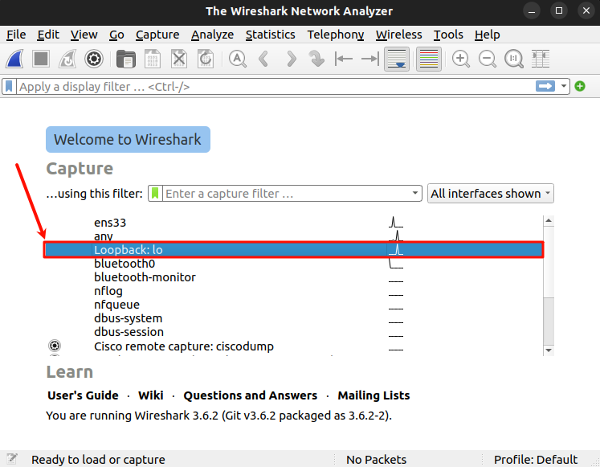
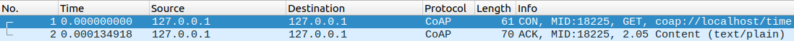
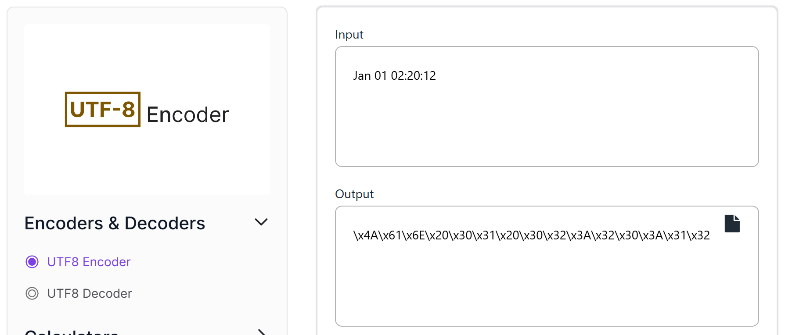

# CoAP 實例

- [CoAP 實例](#coap-實例)
	- [libcoap](#libcoap)
		- [安裝 libcoap](#安裝-libcoap)
		- [啟動伺服器 (coap-server)](#啟動伺服器-coap-server)
		- [啟動客戶端 (coap-client)](#啟動客戶端-coap-client)
	- [Wireshark](#wireshark)
	- [抓包分析](#抓包分析)
		- [請求和回覆](#請求和回覆)
		- [CON 封包](#con-封包)
			- [CoAP 格式](#coap-格式)
			- [CoAP 的 Options 字段](#coap-的-options-字段)
		- [ACK 回復](#ack-回復)
			- [CoAP 的 ACK 回復](#coap-的-ack-回復)


本次將使用 libcoap 來建立 CoAP 伺服器和客戶端，並使用 Wireshark 來抓包分析。

## libcoap

[libcoap](https://github.com/obgm/libcoap) 是一個 C 語言的 CoAP 協議實現，提供了 CoAP 協議的基本功能。

### 安裝 libcoap

```bash
sudo apt install libcoap2-bin
```

### 啟動伺服器 (coap-server)

[coap-server](https://libcoap.net/doc/reference/develop/man_coap-server.html) 是 libcoap 提供的一個 CoAP 伺服器，可以用來接收和回復 CoAP 請求。

```bash
coap-server -v 7    # 啟動伺服器，並設定日誌等級為 7
```

### 啟動客戶端 (coap-client)

[coap-client](https://libcoap.net/doc/reference/develop/man_coap-client.html) 是 libcoap 提供的一個 CoAP 客戶端，可以用來發送 CoAP 請求。

- 發送 **GET** 請求
```bash
coap-client -m get coap://localhost/time
```

## Wireshark

- 安裝 Wireshark

	```bash
	sudo apt install wireshark
	```

	

- 啟動 Wireshark
```bash
sudo wireshark
```

## 抓包分析

發送 **GET** 請求，獲取 **`coap://localhost/time`** 的時間資訊

> Wireshark 選擇 Loopback 網卡
> 
> 

### 請求和回覆



GET 寄送 CON 封包，並收到 ACK 回覆

### CON 封包

#### CoAP 格式


- `Type` 為 **0b00**，表示 CON 封包
- `Code` 為 **1**，表示 GET 請求
- `Options` 選項中的 **`Uri-Host: localhost`**、**`Uri-Path: time`**

> 不存在 `Payload`，因為是 GET 請求

#### CoAP 的 Options 字段


- Option Delta 為 **與前一個 Option 的差值**
- Option Length 為 **Option 的長度**

### ACK 回復

#### CoAP 的 ACK 回復


- `Type` 為 **0b10**，表示 **ACK 回復**
- `Code` 為 **2.05**，表示 **請求已執行**
- `0xFF` 為 **`Payload` 分割符號**
- 最後半段為 **`Payload`**，即 **`Jan 01 02:20:12`**

> 將 `Jan 01 02:20:12` 進行 UTF-8 編碼後可以得到和封包中一樣的字串
> 