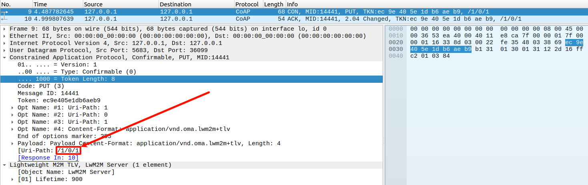
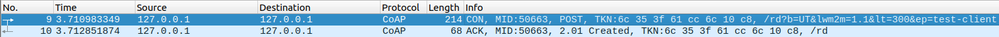
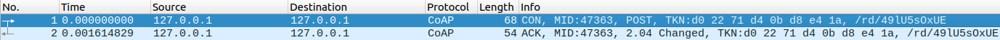
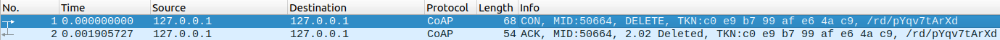
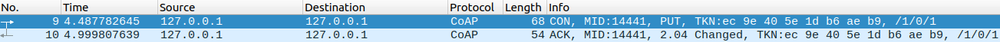
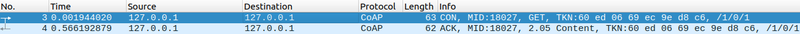
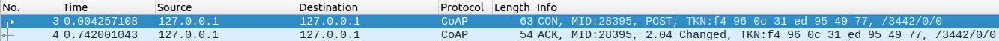

# LwM2M 協議介紹

- [協定 TCP/IP 模型](#%E5%8D%94%E5%AE%9A-tcpip-%E6%A8%A1%E5%9E%8B)
- [LwM2M 架構](#lwm2m-%E6%9E%B6%E6%A7%8B)
	- [直接連線 LwM2M Server](#%E7%9B%B4%E6%8E%A5%E9%80%A3%E7%B7%9A-lwm2m-server)
	- [引導連線 LwM2M Server](#%E5%BC%95%E5%B0%8E%E9%80%A3%E7%B7%9A-lwm2m-server)
- [LwM2M 客戶端](#lwm2m-%E5%AE%A2%E6%88%B6%E7%AB%AF)
	- [Endpoint](#endpoint)
	- [資源模型](#%E8%B3%87%E6%BA%90%E6%A8%A1%E5%9E%8B)
		- [物件結構表示的語法](#%E7%89%A9%E4%BB%B6%E7%B5%90%E6%A7%8B%E8%A1%A8%E7%A4%BA%E7%9A%84%E8%AA%9E%E6%B3%95)
		- [物件資源規範](#%E7%89%A9%E4%BB%B6%E8%B3%87%E6%BA%90%E8%A6%8F%E7%AF%84)
	- [Lifetime](#lifetime)
- [LwM2M 引導伺服器](#lwm2m-%E5%BC%95%E5%B0%8E%E4%BC%BA%E6%9C%8D%E5%99%A8)
	- [工作流程](#%E5%B7%A5%E4%BD%9C%E6%B5%81%E7%A8%8B)
	- [操作](#%E6%93%8D%E4%BD%9C)
		- [初始化設定](#%E5%88%9D%E5%A7%8B%E5%8C%96%E8%A8%AD%E5%AE%9A)
		- [動態更新伺服器配置](#%E5%8B%95%E6%85%8B%E6%9B%B4%E6%96%B0%E4%BC%BA%E6%9C%8D%E5%99%A8%E9%85%8D%E7%BD%AE)
		- [設備重新引導](#%E8%A8%AD%E5%82%99%E9%87%8D%E6%96%B0%E5%BC%95%E5%B0%8E)
		- [資源操作](#%E8%B3%87%E6%BA%90%E6%93%8D%E4%BD%9C)
		- [配置伺服器清單](#%E9%85%8D%E7%BD%AE%E4%BC%BA%E6%9C%8D%E5%99%A8%E6%B8%85%E5%96%AE)
		- [認證與授權](#%E8%AA%8D%E8%AD%89%E8%88%87%E6%8E%88%E6%AC%8A)
	- [操作的對應物件與資源](#%E6%93%8D%E4%BD%9C%E7%9A%84%E5%B0%8D%E6%87%89%E7%89%A9%E4%BB%B6%E8%88%87%E8%B3%87%E6%BA%90)
- [LwM2M 伺服器](#lwm2m-%E4%BC%BA%E6%9C%8D%E5%99%A8)
	- [設備註冊與生命周期管理](#%E8%A8%AD%E5%82%99%E8%A8%BB%E5%86%8A%E8%88%87%E7%94%9F%E5%91%BD%E5%91%A8%E6%9C%9F%E7%AE%A1%E7%90%86)
		- [註冊 (Registration)](#%E8%A8%BB%E5%86%8A-registration)
		- [更新註冊 (Update Registration)](#%E6%9B%B4%E6%96%B0%E8%A8%BB%E5%86%8A-update-registration)
		- [註銷 (Deregister)](#%E8%A8%BB%E9%8A%B7-deregister)
	- [資源操作 (Resource Operations)](#%E8%B3%87%E6%BA%90%E6%93%8D%E4%BD%9C-resource-operations)
	- [訂閱與通知 (Observe & Notify)](#%E8%A8%82%E9%96%B1%E8%88%87%E9%80%9A%E7%9F%A5-observe--notify)
- [伺服器和客戶端互動](#%E4%BC%BA%E6%9C%8D%E5%99%A8%E5%92%8C%E5%AE%A2%E6%88%B6%E7%AB%AF%E4%BA%92%E5%8B%95)
	- [Write 操作](#write-%E6%93%8D%E4%BD%9C)
	- [Read 操作](#read-%E6%93%8D%E4%BD%9C)
	- [Execute 操作](#execute-%E6%93%8D%E4%BD%9C)
	- [觀察 Observe & 通知 Notify](#%E8%A7%80%E5%AF%9F-observe--%E9%80%9A%E7%9F%A5-notify)
- [參考資料](#%E5%8F%83%E8%80%83%E8%B3%87%E6%96%99)


LwM2M(Lightweight Machine-to-Machine) 是一種針對 物聯網(IoT) 場景設計的輕量級協議，建立在 CoAP 協議之上，提供了設備管理和資料傳輸的功能。

## 協定 TCP/IP 模型


LwM2M 是應用層協議，基於 CoAP 協議，不須建立長連接，適合 IoT 設備之間的通信。

## LwM2M 架構

主要分成 **直接連線** 和 **引導連線** 兩種方式:

- 直接連線: 設備直接連線到 **LwM2M Server**
    - 優點:
        - 不需要建置引導伺服器
        - 設備直接連線到主伺服器，速度較快
    - 缺點:
        - 對設備部署和管理的擴展性有限
        - 當憑證過期需要手動更新每個設備
        - 伺服器地址變更，所有設備需要現場手動更改配置

- 引導連線: 設備先連線到 **引導伺服器**，再由 **引導伺服器** 指定連線到 **LwM2M Server**
    - 優點:
        - 支持在運營過程中更改伺服器資訊，無需現場干預
        - 設備只需要連接 Bootstrap Server，即可獲取所有主伺服器、備份伺服器等資訊
        - 支持不同廠商設備統一配置管理
    - 缺點:
        - 需要建置引導伺服器
        - 建立連接速度較慢


### 直接連線 LwM2M Server


- `LwM2M Client`: 客戶端，設備的相關資訊和數據會儲存在 Object 中，例如: 位置、溫度、濕度等
- `LwM2M Server`: 主伺服器，負責管理客戶端，包括註冊、設定、讀寫設備中 Object 等

`LwM2M Client` 連線流程:

1. 客戶端設定 `LwM2M Server` 的地址、端口等資訊
2. 註冊 `LwM2M Server`

### 引導連線 LwM2M Server


- `LwM2M Client`: 客戶端，設備的相關資訊和數據會儲存在 Object 中，例如: 位置、溫度、濕度等
- `LwM2M Bootstrap Server`: 引導伺服器，設定**客戶端**下一階段連線資訊，例如: 主伺服器地址、安全憑證、初始化設備 Object 等
- `LwM2M Server`: 主伺服器，負責管理客戶端，包括註冊、設定、讀寫設備中 Object 等

`LwM2M Client` 連線流程:

1. 設定 `LwM2M Bootstrap Server` 的地址
2. 連線 `LwM2M Bootstrap Server`
3. 根據 `LwM2M Bootstrap Server` 進行初始化設定
   - 設定 `LwM2M Server` 的地址
   - 設定安全憑證
   - 初始化設備 Object
4. 註冊 `LwM2M Server`

## LwM2M 客戶端

### Endpoint

客戶端的唯一識別符，即**設備名稱**，由**客戶端自行設定**。

- 當連線到 `LwM2M Bootstrap Server` 時，會根據 `Endpoint` 進行辨認並載入相應的設定
- 註冊時，`LwM2M Server` 會根據 `Endpoint` 進行辨認

### 資源模型


- **物件 (Object)**
    - 每個物件由一個唯一的 **物件 ID (Object ID)** 標識
    - 對應設備的一個功能模塊，例如: 位置、溫度、濕度等

- **實例 (Instance)**
    - 每個物件可以有**一個或多個實例**
    - 例如: 左手傳感器、右手傳感器

- **資源 (Resource)**
    - 每個實例包含若干資源，資源用於 **存儲數據** 或 **觸發動作**
    - 例如: 傳感器 x, y, z 數值、控制設備重啟

#### 物件結構表示的語法

每個資源的完整標識由 `物件 ID/實例 ID/資源 ID` 表示

```cpp
// Object 0, Instance 1, Resource 2
/0/1/2
```

- 以下伺服器請求客戶端的 Write 操作，資源結構將作為 `Uri-Path` 進行傳遞

    

#### 物件資源規範

OMA SpecWorks 定義了一些標準 物件 ID 和 資源 ID 所代表的意義

| 物件名稱                | 物件 ID | 說明                             |
| ----------------------- | ------- | -------------------------------- |
| Security                | 0       | 包含伺服器安全連接相關配置       |
| Server                  | 1       | 包含伺服器地址、通信參數等資訊   |
| Device                  | 3       | 提供設備相關資訊，如製造商名稱等 |
| Firmware Update         | 5       | 支持固件下載和更新管理           |
| Connectivity Monitoring | 4       | 網絡連接狀態與參數監控           |
| Location                | 6       | 設備的地理位置資訊               |

> 更加詳細的物件資源規範，可以參考
> - Object ID: [omna-lwm2m-objects](https://www.openmobilealliance.org/lwm2m/resources/registry/objects#omna-lwm2m-objects)
> - Resource ID: [omna-lwm2m-resources](https://www.openmobilealliance.org/lwm2m/resources/registry/resources#omna-lwm2m-resources)

### Lifetime

又稱保持連接與心跳 (Keep-Alive)，客戶端定期向伺服器發送 Update 消息，以保持註冊狀態並更新狀態（如 IP 地址變更或資源更新）

- 客戶端需根據配置的生命周期（Lifetime）設定來發送更新請求

## LwM2M 引導伺服器

Bootstrap Server 的設計意圖

- **靈活性**
    - 支持大規模 IoT 部署中的設備動態配置和伺服器切換。
- **簡化初始配置**
    - 設備出廠時無需內嵌伺服器資訊，降低生產成本。
- **集中化管理**
    - 適合需要動態調整伺服器架構或進行多供應商部署的場景。

### 工作流程

1. 設備啟動並發送 Bootstrap Request
   - 當設備啟動且無法連接 LwM2M Server 時，它向 Bootstrap Server 發送請求。

2. Bootstrap Server 下發配置
   - Bootstrap Server 通過 `Write` 或 `Delete` 操作向設備配置伺服器地址、安全參數和其他資源。

3. 設備完成引導
   - 設備根據引導的伺服器資訊向 LwM2M Server 發送註冊請求，開始正常運行。

4. 運行期間的重新配置
   - 需要時，設備可重新與 Bootstrap Server 交互以更新伺服器資訊。

### 操作

Bootstrap Server 主要通過 **Bootstrap Interface** 與客戶端進行交互，其操作可以分為以下幾類

#### 初始化設定

當設備首次啟動且未配置 LwM2M Server 資訊時，Bootstrap Server 可以提供初始配置

- **LwM2M Server 的地址和端口**
    - 包含設備需要連接的主伺服器的 IP 或域名，以及通訊端口。
- **安全憑證**
    - 提供連接 LwM2M Server 所需的安全憑證，例如：
        - 證書
        - 預共享密鑰 (PSK)
        - 公鑰 (Public Key)
        - PKI 證書
    - 這些安全資訊用於 DTLS 層的加密和認證
- **Lifetime**
    - 定義設備在 LwM2M Server 中註冊的有效時長

#### 動態更新伺服器配置

Bootstrap Server 可以在設備的運行期間更新或更改設備的伺服器配置。這包括

- **添加新伺服器配置**
    - 在設備的內存中添加新的 LwM2M Server 配置，例如：
        - 一個新的伺服器地址
        - 與該伺服器的憑據
- **刪除舊伺服器配置**
    - 移除不再需要的伺服器資訊
- **更新已有伺服器的配置**
    - 修改現有伺服器的端口、憑據或其他參數

#### 設備重新引導

當伺服器需要更改設備配置時，可以讓設備重新啟動引導過程，重新與 Bootstrap Server 交互並更新配置。

#### 資源操作

Bootstrap Server 通過 Bootstrap Write 操作可以直接對設備的資源進行配置。以下是資源操作的詳細說明：

- **寫入 (Write)**:
    - 向設備的指定物件或資源寫入數據。例如：
        - 為設備設定伺服器 URI (`/0/1/0` 對應 Security Object 中的伺服器 URI)。
        - 配置安全模式 (`/0/1/2` 表示 Security Mode)。
- **刪除 (Delete)**:
    - 刪除設備上已有的某些伺服器配置，清除不需要的資源。
- **讀取 (Read)**:
    - 訪問設備上的配置資源以確認當前的狀態。

#### 配置伺服器清單

Bootstrap Server 可以維護一個伺服器清單，使客戶端能夠像一個或多個 LwM2M Server 進行「註冊」

#### 認證與授權

Bootstrap Server 也可以用於設備身份的認證，包括：

- 設備是否被授權接入特定伺服器。
- 提供相應的密鑰或憑據進行加密通信。

### 操作的對應物件與資源

LwM2M 的 Bootstrap Server 通過以下標準物件與設備交互:

| 物件名稱   | 物件 ID   | 操作範例                                                   |
| ---------- | --------- | ---------------------------------------------------------- |
| Security   | 0         | 配置伺服器 URI、安全模式、密鑰等                           |
| Server     | 1         | 設定生命週期、默認伺服器優先級等伺服器參數                 |
| 自定義物件 | 自定義 ID | 根據設備需求，配置特定物件和資源（如應用層參數或系統參數） |

**Security 的關鍵資源**
- **伺服器 URI (/0/0/0)**: 用於設置 LwM2M Server 的地址。
- **安全模式 (/0/0/2)**: 定義安全傳輸方式，如無安全模式、PSK 或 RPK。
- **預共享密鑰 (/0/0/5)**: 用於 PSK 安全模式的密鑰。

## LwM2M 伺服器

**LwM2M Server** 是負責管理和控制設備的主要組件。它與 LwM2M 客戶端交互，可以執行一系列操作來管理設備的資源、配置參數和監控狀態。

### 設備註冊與生命周期管理

伺服器應要能夠支援設備的註冊、更新註冊和註銷等操作，以維護設備的生命周期。

#### 註冊 (Registration)

LwM2M 伺服器需要能夠接收來自客戶端的註冊請求，並在伺服器端記錄設備的 Endpoint、Objects 等資訊

- 確認設備的身份
- 獲取設備支持的物件和資源列表

- **註冊流程**
	
    1. 客戶端向伺服器發送註冊請求 (CoAP CON POST 消息)
    2. 伺服器接收請求，記錄客戶端的資訊
    3. 伺服器回復註冊成功或失敗的消息 (CoAP ACK 或 RST 消息)

#### 更新註冊 (Update Registration)

設備定期向伺服器發送更新請求，保持其註冊狀態有效

- 確保設備仍然在線
- 更新設備的 IP 地址、端口等資訊

- **更新註冊流程**
	
    1. 客戶端向伺服器發送更新請求 (CoAP CON POST 消息)
    2. 伺服器接收請求，更新客戶端的資訊
    3. 伺服器回復更新成功或失敗的消息 (CoAP ACK 或 RST 消息)

#### 註銷 (Deregister)

設備主動或伺服器要求設備解除註冊

- 當設備不再需要與伺服器通信時，釋放伺服器資源

- **註銷流程**
	
    1. 客戶端向伺服器發送註銷請求 (CoAP CON DELETE 消息)
    2. 伺服器接收請求，刪除客戶端的資訊
    3. 伺服器回復註銷成功或失敗的消息 (CoAP ACK 或 RST 消息)

### 資源操作 (Resource Operations)

LwM2M 伺服器可以通過 CoAP 協議與客戶端進行資源操作，包括讀取、寫入、觸發等操作

- **讀取 (Read)**:
    - 從設備的指定資源中讀取數據
- **寫入 (Write)**:
    - 修改設備的某個資源值
- **觸發 (Execute)**:
    - 觸發設備執行某個動作
    - 例如: 重啟設備、開關設備

### 訂閱與通知 (Observe & Notify)

- **觀察 (Observe)**:
    - 伺服器訂閱設備某個資源的變化
- **接收通知 (Notify)**:
    - 當資源的值發生變化時，設備主動向伺服器通知變更


## 伺服器和客戶端互動

註冊完成後客戶端可以接收伺服器的請求進行對應的處理

### Write 操作



伺服器向客戶端發送請求 **寫入資料**

1. 伺服器向客戶端發送 **PUT** 請求
    - 請求資源 **Uri-Path:** `/a/b/c`
    - 資料內容 **Payload:** `value`
2. 客戶端接收請求
    - 自定義操作
    - 寫入資料
3. 客戶端向伺服器發送 **ACK** 回復
    - 回復資源 **Uri-Path:** `/a/b/c`

BC66 AT 指令範例:

```cpp
+QLWURC: "write",36560,9,0,0,2,7,"5155454354454C",0     // 接收到伺服器的寫入請求，資料內容為 "5155454354454C"
AT+QLWWRRSP=36560,2                                     // 回復寫入請求
OK

+QLWWRRSP: 0
```

### Read 操作



伺服器向客戶端發送請求 **讀取資料**

1. 伺服器向客戶端發送 **GET** 請求
    - 請求資源 **Uri-Path:** `/a/b/c`
2. 客戶端接收請求
    - 自定義操作
    - 讀取資料
3. 客戶端向伺服器發送 **ACK** 回復
    - 回復資源 **Uri-Path:** `/a/b/c`
    - 資料內容 **Payload:** `value`

BC66 AT 指令範例:

```cpp
+QLWURC: "read",62953,9,0,0                 // 接收到伺服器的讀取請求
AT+QLWRDRSP=62953,1,9,0,0,1,5,"abcde",0     // 回復讀取請求
OK

+QLWRDRSP: 0
```

### Execute 操作



伺服器向客戶端發送請求 **執行操作**，例如: 重設資料、重啟設備等

1. 伺服器向客戶端發送 **POST** 請求
    - 請求資源 **Uri-Path:** `/a/b/c`
2. 客戶端執行操作
3. 客戶端向伺服器發送 **ACK** 回復
    - 回復資源 **Uri-Path:** `/a/b/c`

BC66 AT 指令範例:

```cpp
+QLWURC: "execute",39040,15,0,5     // 接收到伺服器的執行請求
AT+QLWEXERSP=39040,2                // 回復執行請求
OK

+QLWEXERSP: 0
```

### 觀察 Observe & 通知 Notify


- 開始訂閱資源變化

    

    1. 當伺服器想要監控客戶端的資源變化時，可以向客戶端發送 **觀察 (Observe) 請求**
        - **POST** 請求，會在 `Option` 中帶上 `Observe`
        - 請求資源 **Uri-Path:** `/a/b/c`
    2. 客戶端向伺服器發送 **ACK** 回復
        - 回復資源 **Uri-Path:** `/a/b/c`
        - 資料內容 **Payload:** `value`

- 當資源變化時，客戶端主動通知伺服器

    

    1. 當資源變化時，客戶端向伺服器發送 **通知 (Notify)**
        - **Content** 消息
        - 請求資源 **Uri-Path:** `/a/b/c`
        - 資料內容 **Payload:** `value`
    2. 伺服器接收通知，回應空的 **ACK** 消息，表示接收成功

BC66 AT 指令範例:

- Observe 請求

    ```cpp
    +QLWURC: "observe",624,0,9,0,0              // 接收到伺服器的觀察請求
    AT+QLWOBSRSP=624,1,9,0,0,1,5,"abcde",0      // 回復觀察請求
    OK

    +QLWOBSRSP: 0
    ```

- Notify 通知

    ```cpp
    AT+QLWNOTIFY=9,0,0,1,10,"0123456789",0,1    // 通知伺服器資源變化
    OK

    +QLWURC: "report",34180
    +QLWNOTIFY: 0
    +QLWURC: "report_ack",0,34180               // 伺服器回復 ACK
    ```


## 參考資料

- [OMA-TS-LightweightM2M](https://md2html-tool.com/docs/OpenMobileAlliance/LwM2M/master/e58dc1c/TS_Core/OMA-TS-LightweightM2M_Core-V1_2_2-20240613-A_full.html)
- [www.openmobilealliance.org - /release/LightweightM2M/](https://www.openmobilealliance.org/release/LightweightM2M/)
- [openmobilealliance.org/lwm2m/resources/registry/](https://www.openmobilealliance.org/lwm2m/resources/registry)