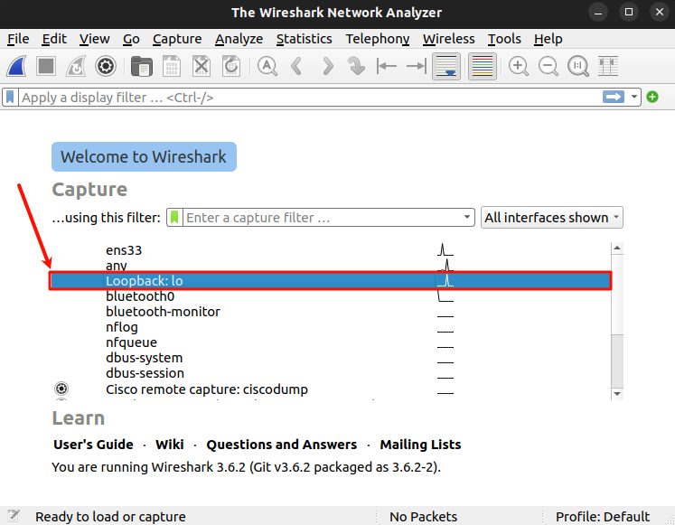

# LwM2M 實例

- [前置作業](#%E5%89%8D%E7%BD%AE%E4%BD%9C%E6%A5%AD)
- [直接連線到 LwM2M 伺服器](#%E7%9B%B4%E6%8E%A5%E9%80%A3%E7%B7%9A%E5%88%B0-lwm2m-%E4%BC%BA%E6%9C%8D%E5%99%A8)
	- [啟動伺服器和客戶端](#%E5%95%9F%E5%8B%95%E4%BC%BA%E6%9C%8D%E5%99%A8%E5%92%8C%E5%AE%A2%E6%88%B6%E7%AB%AF)
	- [伺服器 Web 界面操作](#%E4%BC%BA%E6%9C%8D%E5%99%A8-web-%E7%95%8C%E9%9D%A2%E6%93%8D%E4%BD%9C)
	- [客戶端日誌](#%E5%AE%A2%E6%88%B6%E7%AB%AF%E6%97%A5%E8%AA%8C)
- [透過引導連線到 LwM2M 伺服器](#%E9%80%8F%E9%81%8E%E5%BC%95%E5%B0%8E%E9%80%A3%E7%B7%9A%E5%88%B0-lwm2m-%E4%BC%BA%E6%9C%8D%E5%99%A8)
	- [啟動伺服器和引導伺服器](#%E5%95%9F%E5%8B%95%E4%BC%BA%E6%9C%8D%E5%99%A8%E5%92%8C%E5%BC%95%E5%B0%8E%E4%BC%BA%E6%9C%8D%E5%99%A8)
	- [引導伺服器 Web 界面配置](#%E5%BC%95%E5%B0%8E%E4%BC%BA%E6%9C%8D%E5%99%A8-web-%E7%95%8C%E9%9D%A2%E9%85%8D%E7%BD%AE)
	- [使用引導伺服器進行連線](#%E4%BD%BF%E7%94%A8%E5%BC%95%E5%B0%8E%E4%BC%BA%E6%9C%8D%E5%99%A8%E9%80%B2%E8%A1%8C%E9%80%A3%E7%B7%9A)
- [DSI2598+ 連線到 LwM2M 伺服器](#dsi2598-%E9%80%A3%E7%B7%9A%E5%88%B0-lwm2m-%E4%BC%BA%E6%9C%8D%E5%99%A8)
	- [伺服器端建置](#%E4%BC%BA%E6%9C%8D%E5%99%A8%E7%AB%AF%E5%BB%BA%E7%BD%AE)
	- [內網穿透服務](#%E5%85%A7%E7%B6%B2%E7%A9%BF%E9%80%8F%E6%9C%8D%E5%8B%99)
	- [DSI2598+ 連線抓包分析](#dsi2598-%E9%80%A3%E7%B7%9A%E6%8A%93%E5%8C%85%E5%88%86%E6%9E%90)


[Lenshan](https://github.com/eclipse-leshan/leshan) 是一個 Java 實現的 LwM2M Server 開源專案，建置完畢後可以 **透過 Web 界面** 來管理

本次實例會演示三種不同的 LwM2M 架構組合，使用 Leshan 來架設 **LwM2M Server**、**Bootstrap Server**，並使用 **Leshan Client** 來連線，以下是三種不同的架構組合:

- **Leshan Client** 直接連線到 **LwM2M Server**
- **Leshan Client** 透過 **Bootstrap** 連線到 **LwM2M Server**
- 透過 **DSI2598+** 直接連線到 **LwM2M Server**

## 前置作業

- Java 環境安裝

```bash
sudo apt-get install openjdk-8-jre
```

- 下載 Leshan 的 [server-demo](https://ci.eclipse.org/leshan/job/leshan-ci/job/master/lastSuccessfulBuild/artifact/leshan-demo-server.jar)

```bash
wget https://ci.eclipse.org/leshan/job/leshan-ci/job/master/lastSuccessfulBuild/artifact/leshan-demo-server.jar
```

- 下載 Leshan 的 [client-demo](https://ci.eclipse.org/leshan/job/leshan-ci/job/master/lastSuccessfulBuild/artifact/leshan-demo-client.jar)

```bash
wget https://ci.eclipse.org/leshan/job/leshan-ci/job/master/lastSuccessfulBuild/artifact/leshan-demo-client.jar
```

- 下載 Leshan 的 [bootstrap-demo](https://ci.eclipse.org/leshan/job/leshan-ci/job/master/lastSuccessfulBuild/artifact/leshan-demo-bsserver.jar)

```bash
wget https://ci.eclipse.org/leshan/job/leshan-ci/job/master/lastSuccessfulBuild/artifact/leshan-demo-bsserver.jar
```

## 直接連線到 LwM2M 伺服器


### 啟動伺服器和客戶端

- 啟動 LwM2M Server
    - Web 界面: `http://0.0.0.0:8080/`
    - CoAP 端口: `5683`
    - CoAPS 端口: `5684`

	```bash
	# Bash 1
	java -jar ./leshan-demo-server.jar
	```

	

- 啟動 LwM2M Client

	```bash
	# Bash 2
	java -jar ./leshan-demo-client.jar -n "Client1"
	```

	

### 伺服器 Web 界面操作

- 進入 `http://0.0.0.0:8080/`，可以看到 `Client1` 已經連線

	

- 點選 `Client1` 進入後，可以看到 `Client1` 的 物件、資源、資源實例，並且可以進行操作

    

- 讀取 `1/0/1` 資源，可以看到 Lifetime 的值

    

- 點擊 `W` 進入修改介面，設定 900 秒，並點擊 `WRITE` 發送寫入請求

    

### 客戶端日誌

Lifetime 原始值為 300 秒，修改後為 900 秒後，可以在客戶端日誌看到自動更新註冊時間的變化，由於客戶端需要再 Lifetime 時間內更新註冊，註冊更新時間會比 Lifetime 小

```log
[INFO] Trying to register to coap://localhost:5683 ...              # 嘗試註冊
[INFO] Registered with location '/rd/QT1XMWKSkh'.                   # 註冊成功
[INFO] Next registration update to coap://localhost:5683 in 53s...  
[DEBUG] Read on Server resource /1/0/1                              ## 伺服器讀取請求: Lifetime 為 300 秒 ##
[INFO] Trying to update registration to coap://localhost:5683 ...   # 嘗試更新註冊
[INFO] Registration update succeed.                                 # 註冊更新成功
[INFO] Next registration update to coap://localhost:5683 in 53s...  # 下次註冊更新時間，此時為 53 秒
[DEBUG] Write on Server resource /1/0/1                             ## 伺服器寫入請求: Lifetime 設定為 900 秒 ##
[INFO] Triggering registration update...
[INFO] Trying to update registration to coap://localhost:5683 ...
[INFO] Registration update succeed.
[INFO] Next registration update to coap://localhost:5683 in 653s... # Lifetime 變更後，下次註冊更新時間變為 653 秒
```

## 透過引導連線到 LwM2M 伺服器


### 啟動伺服器和引導伺服器

- 啟動 LwM2M Server
    - Web 界面: `http://0.0.0.0:8080/`
    - CoAP 端口: `5683`
    - CoAPS 端口: `5684`

    ```bash
    # Bash 1
    java -jar ./leshan-demo-server.jar
    ```

    

- 啟動 Bootstrap Server
    - Web 界面: `http://0.0.0.0:8081/`
    - CoAP 端口: `15683`
    - CoAPS 端口: `15684`

    ```bash
    # Bash 2
    java -jar ./leshan-demo-bsserver.jar -lp 15683 -slp 15684 -wp 8081
    ```

	

### 引導伺服器 Web 界面配置

- 進入 `http://0.0.0.0:8081/`，點擊 `ADD CLIENTS CONFIGURATION` 新增客戶端配置

    


- 輸入 `Client1`，並點擊 `NEXT`

    

- `Credentails` 可以配置客戶端的驗證方式，這裡不做設定，直接點擊 `NEXT`

    

- `Paths to delete` 可以配置客戶端啟動後刪除的資源路徑，這裡保持預設，直接點擊 `NEXT`

    

- 設定 `LwM2M Server` 的地址，這裡設定為 `coap://localhost:5683`，並點擊 `ADD` 完成配置

    

- 完成後可以在主頁看到 `Client1` 的配置

    

### 使用引導伺服器進行連線

- 啟動 LwM2M Client

    ```bash
    # Bash 3
    java -jar ./leshan-demo-client.jar -b -u coap://localhost:15683 -n Client1
    ```

- 可以在 `http://0.0.0.0:8081/#/bootstrap/Client1` 看到客戶端 `Client1` 的引導過程

    

- 引導完成後，可以在 `http://0.0.0.0:8080/` 看到 `Client1` 已經連線

    


## DSI2598+ 連線到 LwM2M 伺服器


### 伺服器端建置

- 啟動 LwM2M Server
    - Web 界面: `http://0.0.0.0:8080/`
    - CoAP 端口: `5683`
    - CoAPS 端口: `5684`

    ```bash
    # Bash 1
    java -jar ./leshan-demo-server.jar
    ```

    

### 內網穿透服務


- 下載 [Github frp](https://github.com/fatedier/frp/releases)

```bash
wget https://github.com/fatedier/frp/releases/download/v0.61.0/frp_0.61.0_linux_amd64.tar.gz
```

- 解壓縮

```bash
tar -zxvf frp_0.61.0_linux_amd64.tar.gz
```

- FRPC 配置

```toml
serverAddr = "quiz.us.kg"
serverPort = <PORT>

auth.method = "token"
auth.token = "<TOKEN>"

[[proxies]]
name = "<NAME>"
type = "udp"
localIP = "0.0.0.0"
localPort = <PORT>
remotePort = <PORT>
```

- 啟動 FRPC

```bash
./frpc -c frpc.toml
```

### DSI2598+ 連線抓包分析

- 選擇 Loopback 網卡，開始抓包

    

- DSI2598+ 連線到 LwM2M 伺服器

    ```cpp
    // 設定 LwM2M 伺服器地址和端口
    03:18:44.458 -> AT+QLWSERV="quiz.us.kg",2000
    03:18:44.458 -> OK
    // 設定 客戶端名稱
    03:18:48.047 -> AT+QLWCONF="DSI2598"
    03:18:48.087 -> OK
    // 添加（創建）物件 19/0/0
    03:18:51.757 -> AT+QLWADDOBJ=19,0,1,"0"
    03:18:51.757 -> OK
    // 添加（創建）物件 19/1/0
    03:18:56.085 -> AT+QLWADDOBJ=19,1,1,"0"
    03:18:56.085 -> OK
    // 連接 LwM2M 伺服器
    03:19:00.410 -> AT+QLWOPEN=0
    03:19:00.410 -> OK
    03:19:01.759 -> 
    03:19:01.759 -> CONNECT OK
    ```

- 伺服器 Web 介面發送 觀察 (Observe) 請求

	

    - DSI2598+ 接收到觀察 (Observe) 請求

        ```cpp
        03:19:14.781 -> +QLWOBSERVE: 0,19,0,0
        ```

- DSI 主動向伺服器發送資料

    ```cpp
    03:19:19.551 -> AT+QLWCFG="dataformat",1,1
    03:19:19.598 -> OK
    // 目標資源 19/0/0，資料長度 1byte，資料類型 0x00，封包類型 0x0000 (NON)
    03:25:14.002 -> AT+QLWDATASEND=19,0,0,1,00,0x0000
    03:25:14.033 -> OK
    // 目標資源 19/0/0，資料長度 1byte，資料類型 0x00，封包類型 0x0100 (CON) 
    03:25:25.749 -> AT+QLWDATASEND=19,0,0,1,00,0x0100
    03:25:25.749 -> OK
    03:25:26.857 -> 
    03:25:26.857 -> SEND FAIL
    ```

    > 注意: `SEND FAIL` 是因為 DSI2598+ 上的 BC26 晶片發送的 Notify 封包與標準格式不符合，導致伺服器無法解析，實際抓包可以看到 Notify 封包已經發送成功，如果需要解決此問題，可以自行根據 BC26 的協議進行伺服器端的調整

- 發送註冊更新請求，用於保持註冊狀態
    ```cpp
    03:26:29.964 -> AT+QLWUPDATE
    03:26:29.964 -> OK
    03:26:32.840 -> 
    03:26:32.840 -> UPDATE OK
    ```

- 關閉連線

    ```cpp
    03:27:41.020 -> AT+QLWCLOSE
    03:27:41.020 -> OK
    03:27:41.935 ->
    03:27:41.935 -> CLOSE OK
    ```

- 刪除 LwM2M 相關的上下文

    ```cpp
    03:27:45.565 -> AT+QLWDEL
    03:27:46.949 -> OK
    ```

- 抓包結果

	