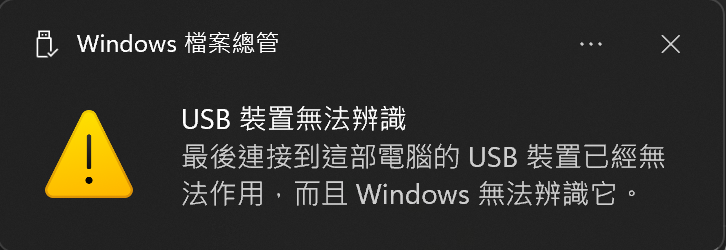

# DSI2598+ 修理紀錄

- [Micro USB 腳位脫焊](#micro-usb-%E8%85%B3%E4%BD%8D%E8%84%AB%E7%84%8A)
	- [排查處理](#%E6%8E%92%E6%9F%A5%E8%99%95%E7%90%86)
- [USB 裝置無法辨識](#usb-%E8%A3%9D%E7%BD%AE%E7%84%A1%E6%B3%95%E8%BE%A8%E8%AD%98)
	- [bootloader 燒錄方式](#bootloader-%E7%87%92%E9%8C%84%E6%96%B9%E5%BC%8F)
- [供電 IC 損壞](#%E4%BE%9B%E9%9B%BB-ic-%E6%90%8D%E5%A3%9E)
	- [排查紀錄](#%E6%8E%92%E6%9F%A5%E7%B4%80%E9%8C%84)

DSI2598+ 常見的損壞狀況，以及處理方法

## Micro USB 腳位脫焊

### 排查處理
判斷脫焊方式，輕微波動 Micro USB 腳位，LED 燈會不斷閃爍，重新使用電烙鐵焊接

## USB 裝置無法辨識

發生以下情況，則必須重新燒錄 bootloader
- 當開發板 USB 發生異常插拔，造成開發板內 bootloader 失效
- 安裝驅動程式無效
- 程式撰寫有異常造成 bootloader 失效
- 電腦無法辨識開發板
- 無法選擇直接以 Arduino IDE 透過 USB 上傳程式

### bootloader 燒錄方式

通過 USB 串口通訊器燒錄，這裡以 CH340 為例

- 安裝 CH340 驅動
	- 下載地址: [CH341SER.EXE - 南京沁恒微电子股份有限公司](https://www.wch.cn/download/ch341ser_exe.html)
- 安裝燒錄軟體
	- 官網下載: [STM32CubeProg](https://www.st.com/en/development-tools/st-link-v2.html#tools-software)
	
- 下載燒錄檔案
	- Github: [GitHub - rogerclarkmelbourne/STM32duino-bootloader: Bootloader for STM32F103 boards, for use with the Arduino\_STM32 repo and the Arduino IDE](https://github.com/rogerclarkmelbourne/STM32duino-bootloader)
		
- 燒錄接線
	
- 使用 STM32CubeProg 燒錄
	- 連線至 STM32 (連接前需要按 Reset 鈕進行重製)
		
	- 燒錄
		
	- 選取燒錄檔案開始燒錄
		
- 燒錄完成
	

## 供電 IC 損壞

購買 ME6211C33M5G 通電 IC 替換即可

### 排查紀錄

1. 找出異常: 電表量測，根據接線圖從電源端開始量測，查找電壓異常變化點
	- 理論 3.3V 的電壓點
		
	- 實際為 0.9V
		
	- 查找異常點的電路設計，找到影響該異常的 IC
		- [DSI2598p](../使用者手冊/DSI2598P/dsi2598p.pdf) 和 [ME6211C](../使用者手冊/DSI2598P/ME6211.pdf) (供電 IC) 的原理圖
			
- 啟動電流觀察: 透過電流計觀察供電 IC 異常電流狀況
	- 正常的啟動電流 0.03A
		
	- 異常的啟動電流 0.009A
		
	- 無法順利啟動強制供電 3.3V，電流**偏高**，可能是**供電 IC**造成漏電流
		
	- 拆除供電 IC，再次強制供電 3.3V，電流恢復正常
		