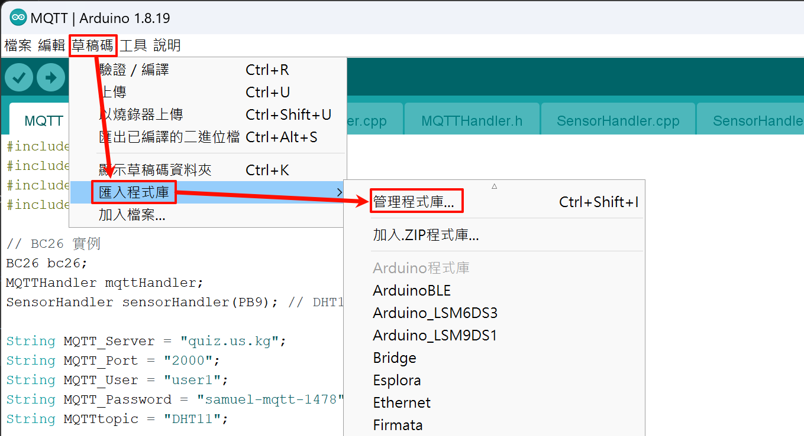
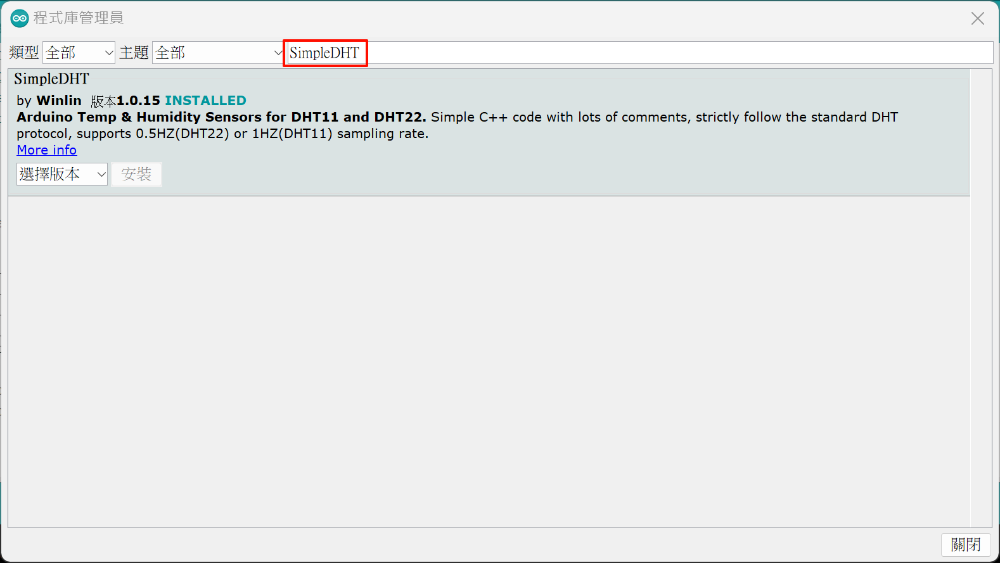
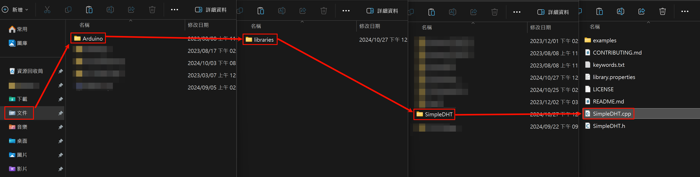
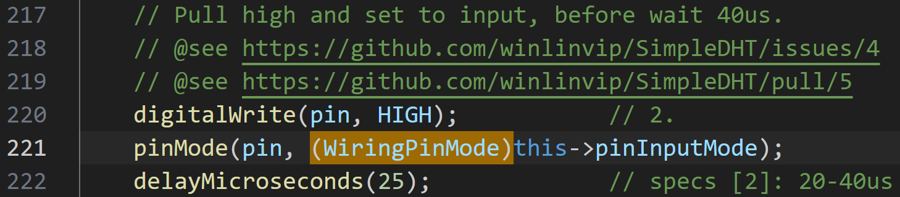
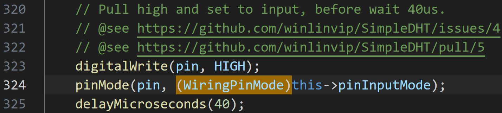

# 偵測溫溼度應用

本次實作使用 DIS2598+ 讀取 DHT 溫溼度感測器的資料，並將資料上傳到 MQTT 伺服器。

## DHT 溫溼度感測器

- DHT
	
	- **Data 輸出**: 數位訊號
	- **N/C**: 不連接 (無功能)
- DHT11
    - **供電電壓**: 3V ~ 5.5V
    - **溫度範圍**: 0°C ~ 50°C / ±2°C
    - **濕度範圍**: 20% ~ 80% / ±5%
    - **更新頻率**: 1Hz
    - **尺寸**: 15.5mm x 12mm x 5.5mm
- DHT22
    - **供電電壓**: 3V ~ 5.5V
    - **溫度範圍**: -40°C ~ 125°C / ±0.5°C
    - **濕度範圍**: 0% ~ 100% / ±2-5%
    - **更新頻率**: 0.5Hz
    - **尺寸**: 15.1mm x 25mm x 7.7mm

## DSI2598+ 接線圖


- **VCC**: 連接到 3.3V
- **GND**: 連接到 GND
- **Data**: 連接到 PB9

## 安裝 SimpleDHT 函式庫

- 進入**管理程式庫**

    

- 搜尋 `SimpleDHT` 並安裝

    

- 修正函式庫錯誤
    1. 點擊文件 -> Arduino -> libraries -> SimpleDHT -> SimpleDHT.cpp
		
    2. 修改 `221` 行和 `324` 行添加上 `(WiringPinMode)`
	    
	    

> **注意**: 修正函式庫錯誤是因為 DSI2598+ 屬於 STM32F4 系列，而 SimpleDHT 函式庫預設為 Arduino UNO，所以需要修改函式庫。

## DSI2598+ 發布溫溼度資料程式

- 修改 `MQTT` 伺服器資訊
```cpp
String MQTT_Server = "<SERVER_URL>";
String MQTT_Port = "<SERVER_PORT>";
String MQTT_User = "<USER>";
String MQTT_Password = "<PASSWORD>";
String MQTTtopic = "<TOPIC>";
```